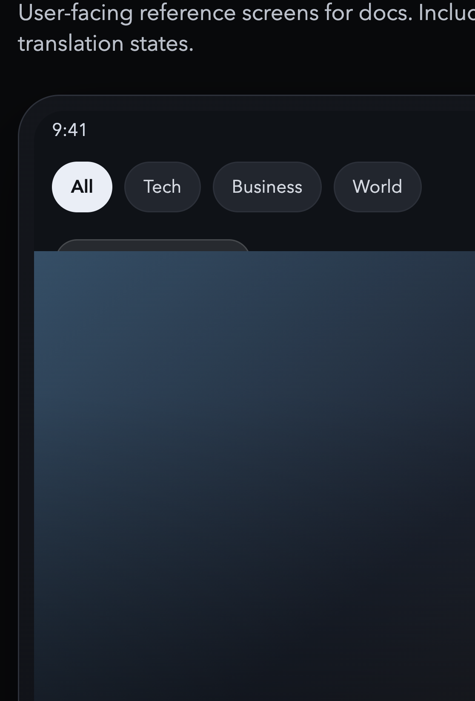
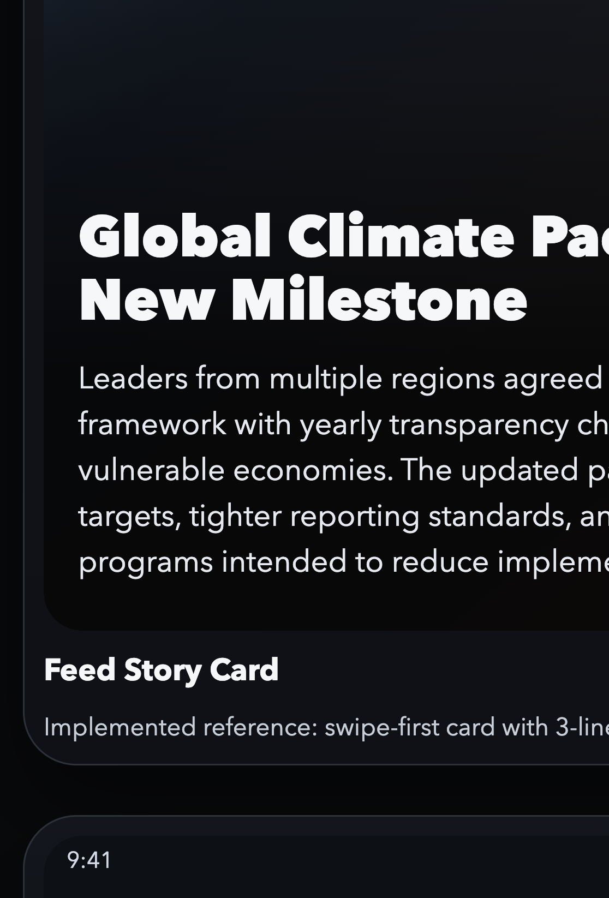
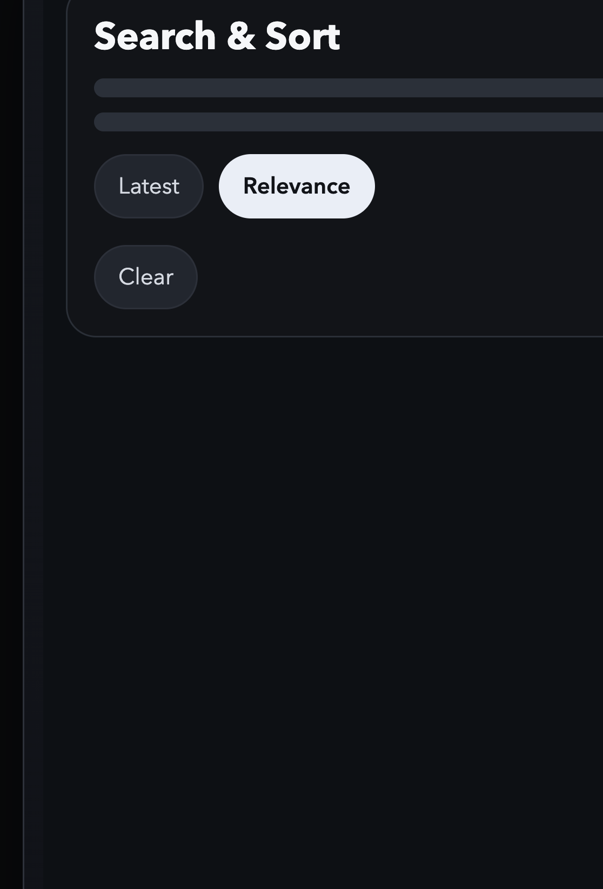
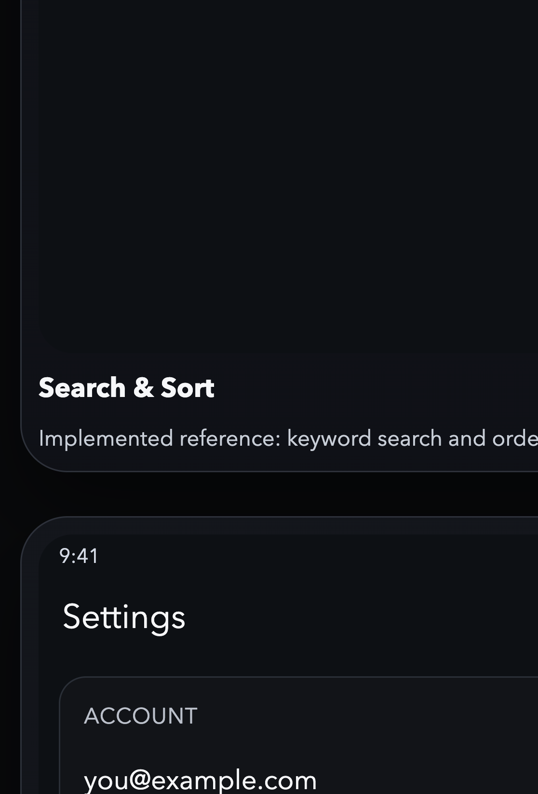
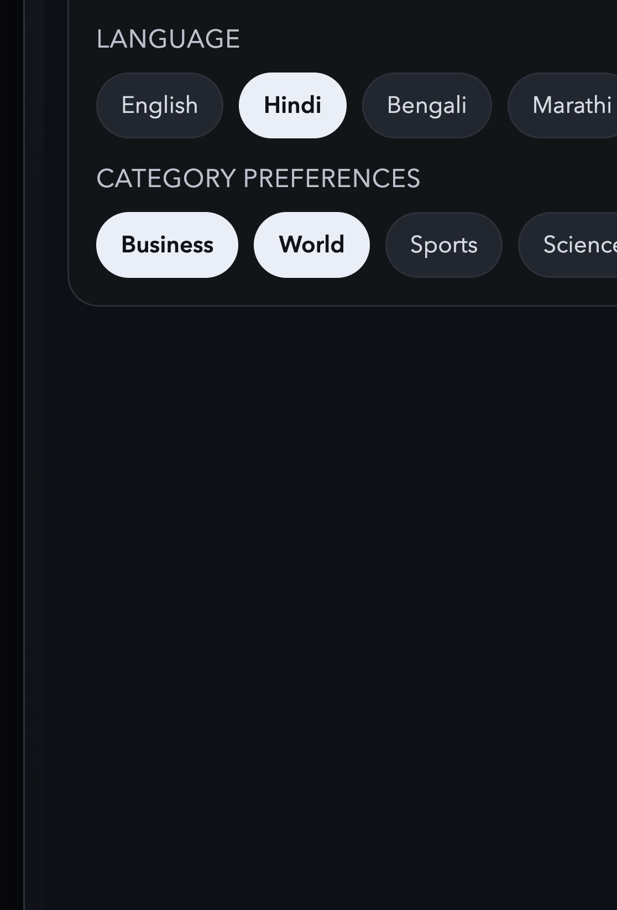
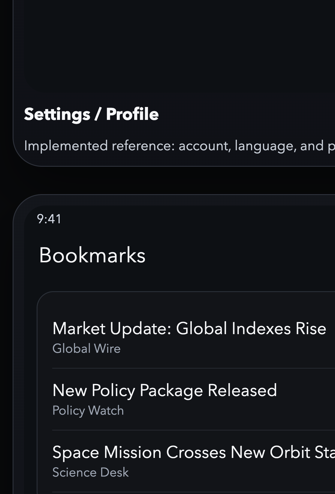

# Vruttaant User Experience Guide

**Audience**: Product, design, QA, and engineering
**Purpose**: Describe how a user uses the app today, what pages they should expect, and what scenarios should work end-to-end.
**Last updated**: May 18, 2026

---

## 1) Product Promise (User View)

Vruttaant gives users a fast, swipe-first way to discover news, personalize their feed, and control notifications without leaving the flow.

Primary value for users:
- Read short, visual news cards quickly
- Move between stories with vertical swipes
- Open full article view when needed
- Personalize feed with language and categories
- Read news content in a comfortable language (planned translation enhancement)
- Save stories to bookmarks
- Manage account and notification preferences

---

## 2) App Navigation Map (Expected Pages)

### A. Feed Page (Home)
This is the default entry page and main interaction surface.

User can:
- Swipe vertically to move between stories
- Pull to refresh for latest feed
- Browse by category chips (All, Tech, Politics, Sports, etc.)
- Open Search & Sort panel
- Open Settings/Profile page
- Open Bookmarks sheet

Key UI controls:
- Category chip row at top
- Search button (top-right)
- Settings button (top-right)
- Bookmarks button (top-right)

### B. Story Reader View (per card)
Each story supports a second horizontal page.

User can:
- Swipe horizontally from card to article reader view
- Open article in embedded web view (supported platforms)
- See fallback "Read More" view when embedded view is unavailable

### Story Card Content Length Specification
Current implemented limits for readability and layout stability:

- Title render length: maximum 3 lines (shorter titles use fewer lines)
- Summary render length: up to 12 lines, constrained to about 48% of screen height
- Summary generation target: approximately 60 words
- Summary generation bounds: minimum 45 words, maximum 75 words

Notes:
- Long text beyond visual limits is truncated with ellipsis.
- Summary word bounds are backend-configurable via environment variables.

### C. Search & Sort Bottom Sheet
Opened from Feed page.

User can:
- Search by keyword (title/summary/source)
- Choose sort mode:
  - Latest
  - Relevance
- Apply or clear filters

### D. Settings/Profile Page
Opened from Feed page.

User can:
- See account status (signed in / signed out)
- Sign in or sign out
- Choose language preference
- Select preferred categories
- Configure notification preferences
- View registered notification devices
- Remove a registered device

### G. Language & Translation Experience (Planned Core Feature)
This is a core planned feature that extends the current language preference flow.

User can (target behavior):
- Set a preferred reading language from Settings/Profile
- See story summaries in that preferred language by default
- Trigger translation on demand for a specific story when needed
- Keep the original article link available for source verification

### E. Bookmarks Sheet
Opened from Feed page.

User can:
- View saved stories
- Remove bookmarks
- Open bookmarked story
- Trigger sign-in flow if not authenticated

### F. Sign-In Sheet
Shown when user taps sign-in entry point (Settings/Profile or bookmark-required action).

User can:
- Enter email and password
- Submit credentials
- See validation/authentication errors

### Visual References (Implemented + Planned)
The screenshots below are included for product review and expectation setting.

Implemented screens:

#### Feed Story Card

#### Search and Sort

#### Settings and Profile

#### Bookmarks

#### Reader View

Planned screen:

#### Translation State (Planned)

---

## 3) Core User Scenarios

## Scenario 1: New user opens app and starts reading
1. User launches app.
2. Feed page loads first page of stories.
3. User swipes up/down to browse.
4. User opens full article with horizontal swipe.

Expected result:
- Smooth feed loading with no required authentication.
- Story browsing works without account creation.

## Scenario 2: User narrows feed by category
1. User taps a category chip (example: Business).
2. Feed reloads with matching cards.
3. User can switch back to All.

Expected result:
- Category selection updates results quickly.
- Active category is clearly highlighted.

## Scenario 3: User searches for topic and switches to relevance
1. User opens Search & Sort.
2. Enters query (example: "election" or "market").
3. Selects Relevance.
4. Taps Apply.

Expected result:
- Feed refreshes with query-aware ordering.
- Query and sorting feel consistent with returned stories.

## Scenario 4: User signs in and saves stories
1. User taps bookmark icon on a story.
2. If signed out, app prompts sign-in.
3. User signs in successfully.
4. User taps bookmark again to save.
5. User opens Bookmarks to verify saved story.

Expected result:
- Sign-in unlocks bookmark actions.
- Saved item appears in bookmarks list.

## Scenario 5: User updates profile preferences
1. User opens Settings/Profile.
2. Changes language.
3. Selects preferred categories.
4. Taps Save.
5. Returns to feed.

Expected result:
- Preferences persist across app restarts.
- Feed behavior reflects updated language/profile where applicable.

## Scenario 6: User manages notification settings
1. User opens Settings/Profile.
2. Toggles notification options (enabled, breaking, digest, etc.).
3. Saves changes.
4. Reviews registered devices.
5. Optionally removes a device.

Expected result:
- Notification settings save successfully.
- Device list reflects actual backend registrations.

## Scenario 7: User signs out
1. User opens Settings/Profile.
2. Taps Sign Out.
3. Returns to feed and tries bookmark action.

Expected result:
- Session is cleared.
- Protected actions require sign-in again.

## Scenario 8: User reads in preferred language (planned)
1. User opens Settings/Profile.
2. User selects preferred language (example: Hindi).
3. User returns to feed.
4. New cards and summaries are shown in selected language where available.
5. For a card not available in selected language, user taps Translate.
6. App shows translated summary/content while preserving source attribution.

Expected result:
- User gets a consistent reading experience in chosen language.
- User can still access original source for trust and context.

---

## 4) UX States to Verify (QA Checklist)

### Loading states
- Initial feed loading indicator
- Load-more indicator near end of feed
- Settings/Profile loading state for account data

### Empty states
- No stories available
- No bookmarks yet
- No registered notification devices

### Error states
- Feed load error with retry path
- Sign-in failure messaging
- Notification save failures
- Profile update failures

### Access states
- Signed-out behavior for protected actions
- Signed-in behavior for bookmarks/settings sync

---

## 5) Current Behavior vs Product Expectations

### Currently implemented
- Swipe-first feed with refresh and pagination
- Search and sort controls
- Category filtering
- Sign-in and sign-out
- Bookmark add/list/delete
- Dedicated settings/profile page
- Notification preferences and device management UI hooks
- Language preference selection and backend sync
- Multi-language summary generation support in backend pipeline

### Planned (not fully shipped in UX yet)
- On-demand per-story translation control in feed/reader
- Strong fallback behavior when translation is unavailable
- Translation status indicators (original vs translated)
- Clear user controls for switching between original and translated text

### Product expectations to validate with stakeholders
- Should onboarding exist before first feed load?
- Should sign-up be exposed in app (not only sign-in)?
- Should categories directly change feed ranking logic beyond filter?
- Should bookmarks support folders/tags?
- Should we add a dedicated notifications inbox page?
- Should translation be automatic for every story or user-triggered per story?

---

## 6) Planned Translation Feature Design (User-Facing)

This section documents how translation is expected to work for users.

### 6.1 User intent
Users should be able to consume news in their comfortable language without losing trust in original sources.

### 6.2 UX behavior (target)
1. Preferred language is set in Settings/Profile.
2. Feed requests content in that language first.
3. If content is not available in preferred language, show a Translate action on the card.
4. User taps Translate to generate/fetch translated text.
5. UI clearly labels content as Translated and keeps Original option available.

### 6.3 Visibility cues for users
- Badge: Original / Translated
- Action: Translate / Show Original
- Lightweight status: Translating..., Translation unavailable

### 6.4 Error and fallback behavior
- If translation fails, keep original summary and show non-blocking message.
- If translation is delayed, allow user to continue feed browsing.
- If language is unsupported for a specific card, show clear fallback copy.

### 6.5 Rollout expectation
- Phase 1: Preferred language feed behavior and summary-level translation consistency.
- Phase 2: Per-story on-demand translation control in feed and reader view.
- Phase 3: Optimization for speed, caching, and translation quality signals.

---

## 7) Suggested Acceptance Criteria (User-Facing)

Use these for release review from a user perspective:

1. User can browse feed without login.
2. User can search, sort, and filter stories successfully.
3. User can sign in and bookmark stories reliably.
4. User can open and manage bookmarked stories.
5. User can update language/categories and see persistence.
6. User can update notification preferences and manage devices.
7. User can sign out and protected features lock correctly.
8. User can switch to preferred language and receive translated/target-language content where available.
9. User can toggle between translated and original text for a story (planned target behavior).

---

## 8) Deviation Log (For Product Review)

Use this section during review meetings to capture changes requested by product/user testing.

| Date | Requested Change | Why (User Perspective) | Impacted Areas | Priority |
|------|------------------|-------------------------|----------------|----------|
| TBD  | TBD              | TBD                     | TBD            | TBD      |

---

## 9) How this feeds roadmap updates

When deviations are approved:
1. Add the change to this document under Deviation Log.
2. Translate each approved deviation into implementation tasks in ROADMAP.
3. Reflect completion and rollout in PROJECT_STATUS.
4. Add test coverage notes (widget tests, integration tests, manual scenarios).

This keeps user intent, implementation sequence, and delivery status aligned.
